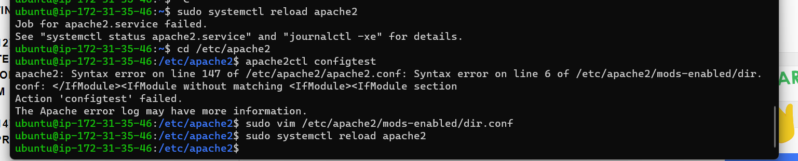

# PROJECT 1 DOCUMENTATION: LAMP STACK IMPLEMENTATION


**Scope:** to generate and implement LAMP components 


### Set up OpenSSH server and connect to EC2 instance


1. Create an EC2 instance of t2.micro family with Ubuntu Server 20.04 LTS (HVM) in AWS
   

   links for help: 
   

   [Install OpenSSH for Windows](https://learn.microsoft.com/en-us/windows-server/administration/openssh/openssh_install_firstuse?tabs=powershell)
   
   
   [Key-based authentication in OpenSSH for Windows](https://learn.microsoft.com/en-us/windows-server/administration/openssh/openssh_keymanagement)


   [Using EC2 as your virtual server](https://www.youtube.com/watch?v=xxKuB9kJoYM&list=PLtPuNR8I4TvkwU7Zu0l0G_uwtSUXLckvh&index=7)   
   
   
   [connecting to EC2 instance in AWS](https://www.youtube.com/watch?v=TxT6PNJts-s&list=PLtPuNR8I4TvkwU7Zu0l0G_uwtSUXLckvh&index=8)


2. Open terminal and move into the folder where you saved your public key, use `cd <folder>`


    **NOTE** to ensure that your key is not publicly viewable run `chmod 400 PBL_key_pair.pem`, otherwise you could get a "Bad permissions" error


2. Start your EC2 instance in AWS and SSH into it(=connect) with public key and its Public DNS in you terminal


    use: `ssh -i <private-key-name>.pem ubuntu@<Public-IP-address>` 


### Install Apache and update the Firewall


1. Update **apt** package manager in Ubuntu with `sudo apt update`


2. install Apache package with `sudo apt install apache2`


3. verify that Apache is running with  `sudo systemctl status apache2` 


    **Note** In order to access you Apache web server you need to configure an open connection through port 80 in AWS- add it to the inbound rules in the network settings (security groups)


 4. Test that the web server responds to requests for the Internet


    Try to access it with Google Chrome (or any other browser) with the URL  `http://<Public-IP-Address>:80` replacing `<Public-IP-Address>` with your instance IP address or you can use its DNS name instead


### Install MySQL and run security script


1. Run `$ sudo apt install mysql-server` and confirm installation with `Y`


2. Login to MySQL with `$ sudo mysql`


3. Set password for system root user with ` ALTER USER 'root'@'localhost' IDENTIFIED WITH mysql_native_password BY '<password>';` for access to database


4. exit MySQL with `exit`


5. Run security script with  `sudo mysql_secure_installation` to set password for MySQL


    **Note** after this command you will be asked if you want to enable the VALIDATE PASSWORD PLUGIN, to validate a password for the database root user. If enabled, MySQL will reject passwords with an error if they don't meet the specified criteria. 

    ```
    # There are three levels of password validation policy:

    LOW    Length >= 8
    MEDIUM Length >= 8, numeric, mixed case, and special characters
    STRONG Length >= 8, numeric, mixed case, special characters and dictionary              file

    Please enter 0 = LOW, 1 = MEDIUM and 2 = STRONG: 1
    ```

    **Note** In level 2 validation, you should choose a complex password with a mix of upper and lowercase letters, special characters and numbers otherwise you will get an error


    *Comments: At this point, I had trouble figuring out how to enter the password, as nothing appeared on my screen as I typed. Later, I realized I was not supposed to see the password while typing.*


4. After validating password (or not) press `y` for all other questions


5. Test your new password with `$ sudo mysql -p`

 
    **Note** make sure you have mysql_native_password configured for PHP applications as MySQL PHP library mysqlnd doesn’t support caching_sha2_authentication, the default authentication method for MySQL 8. 


###  Install PHP


1.  Install 3 PHP packages using `sudo apt install php libapache2-mod-php php-mysql`


2. check that PHP is installed correctly with `php -v`


    


### Configure Virtual Host with Apache


1. Set up a configuration inside /var/www for your server's domain, here we call the domain projectlamp.

`sudo mkdir /var/www/projectlamp` to to serve documents from your domain


2. Give ownership of your domain's directory to the system user with ` sudo chown -R $USER:$USER /var/www/projectlamp`


3. Run `sudo vi /etc/apache2/sites-available/projectlamp.conf` to open a new configuration in Apache "sites-available" directory. Paste the following into the file, then save and exit the editor.


    ```
    <VirtualHost *:80>
    ServerName projectlamp
    ServerAlias www.projectlamp 
    ServerAdmin webmaster@localhost
    DocumentRoot /var/www/projectlamp
    ErrorLog ${APACHE_LOG_DIR}/error.log
    CustomLog ${APACHE_LOG_DIR}/access.log combined
    </VirtualHost>
    ```


4. check that the file has been created with `sudo ls /etc/apache2/sites-available`


5. start the Virtual Host with `sudo a2ensite projectlamp`


6. Run `sudo a2dissite 000-default` to disable Apache default website which can overwrite your Virtual Host


7. Run `sudo apache2ctl configtest` to test for syntax errors in teh configuration file


8. Run `sudo systemctl reload apache2` to make the changes effective


9. Create a index.html file in **/var/www/projectlamp** and paste the following 


    ```
    sudo echo 'Hello LAMP from hostname' $(curl -s http://169.254.169.254/latest/meta-data/public-hostname) 'with public IP' $(curl -s http://169.254.169.254/latest/meta-data/public-ipv4) > /var/www/projectlamp/index.html
    ```


10. Test your Virtual Host through your browser: `http://<Public-IP-Address>:80`


    You should see the message from the index.html file


    


### Enabling PHP on the website


**Note** files named index.html take precedence over those named index.php


You need to change this behavior in the "/etc/apache2/mods-enabled/dir.conf" file


1. Go to `sudo vim /etc/apache2/mods-enabled/dir.conf`


2. swap index.html with index.php in the "DirectoryIndex" directive. Then save and exit the file.

    ```
    <IfModule mod_dir.c>
        #Change this:
        #DirectoryIndex index.html index.cgi index.pl index.php index.xhtml index.htm
        #To this:
        DirectoryIndex index.php index.html index.cgi index.pl index.xhtml index.htm
    </IfModule>
    ```
    

3. Reload Apache with `sudo systemctl reload apache2`

    *Comments: When my reload of Apache failed, I looked up the error on Google and found that it was caused by a syntax error. Using `apache2ctl configtest`, I found that the error was in dir.conf, which I had recently modified. After deleting the error I was able to successfully reload the Apache.*


    


4. Test that Apache is able to handle PHP files: create an index.php file inside the projectlamp domain with `vim /var/www/projectlamp/index.php`


5. Copy this inside the file

    ```
    <?php
    phpinfo();
    ```


    Save and exit the editor. Reload the `http://<Public-IP-Address>:80` page in your browser and you shall see something like this


    


6. Run `sudo rm /var/www/projectlamp/index.php` to remove the file as it contains sensitive information


