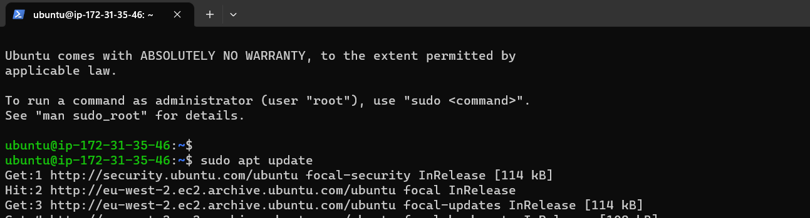
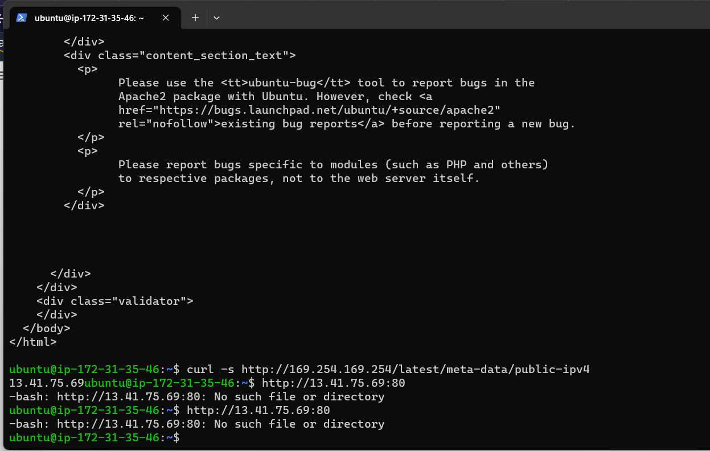

# **PROJECT 1 DOCUMENTATION: LAMP STACK IMPLEMENTATION**

## **Step 1: Setting uo OpenSSH server and connecting to EC2 instance**
    1. I entered directory where .pem key was saved using `cd`, in my case I typed in "cd Downloads"
    2. I connected to AWS server using ssh: "ssh -i "PBL_key_pair.pem" ubuntu@ec2-13-41-225-1.eu-west-2.compute.amazonaws.com"

I installed and configured OpenSSH server, and generated your private and public keys before connecting to the AWS server  

Links for help 
 [Install OpenSSH for Windows](https://learn.microsoft.com/en-us/windows-server/administration/openssh/openssh_install_firstuse?tabs=powershell)             [Key-based authentication in OpenSSH for Windows](https://learn.microsoft.com/en-us/windows-server/administration/openssh/openssh_keymanagement)

## **Step 2: Installing Apache and updating the Firewall**

I used the folliwing commands

`sudo apt update` to update a list of packages in package manager

`sudo apt install apache2` to run apache2 package installation

Then  `sudo systemctl status apache2` to verify that apache2 is running

I could not understand the last bit of step 1, the *curl* part. Can you please explain.

## **Step 3: Installing MySQL**

I used command
`sudo apt install mysql-server` to install MySQL,
selected `Y` for yes when asked,
then used command
`sudo mysql` to log into MySQL 

### **Setting password for root user on MySQL**

1. I ran command `ALTER USER 'root'@'localhost' IDENTIFIED WITH mysql_native_password BY 'PassWord.1';` to set passwor for system root 
2. typed
`exit` and exited the console
3. Ran `sudo mysql_secure_installation`  for password validation

At this point, I had trouble figuring out how to enter the password, as nothing appeared on my screen as I typed. Later, I realized I wasn't supposed to see the password while typing.

3. I selected level 1 for password validation then entered a new password for the root user 

4. Then logged back into MySql using `sudo mysql -p`, and exited teh console.

## Step 4: STEP 3 — INSTALLING PHP

