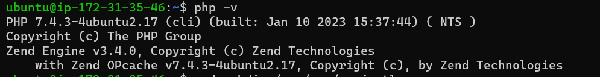

# **PROJECT 1 DOCUMENTATION: LAMP STACK IMPLEMENTATION**

Scope: to gain familiarity with the Linux terminal and commands,  to generate and implement LAMP components 

## **Step 1: Setting up OpenSSH server and connecting to EC2 instance**

AWS server was connected to with ssh 
`ssh -i "PBL_key_pair.pem" ubuntu@ec2-13-41-225-1.eu-west-2.compute.amazonaws.com`
 

Links used for help 
 [Install OpenSSH for Windows](https://learn.microsoft.com/en-us/windows-server/administration/openssh/openssh_install_firstuse?tabs=powershell)             [Key-based authentication in OpenSSH for Windows](https://learn.microsoft.com/en-us/windows-server/administration/openssh/openssh_keymanagement)


## **Step 2: Installing Apache and updating the Firewall**

Following installation of components, Apache status was confirmed 


I could not understand the last bit of step 1, the *curl* part. Can you please explain


## **Step 3: Installing MySQL**

Successful installation of MySQL


### **Setting password for root user on MySQL**

- Running `sudo mysql_secure_installation`  for password validation

At this point, I had trouble figuring out how to enter the password, as nothing appeared on my screen as I typed. Later, I realized I wasn't supposed to see the password while typing. I was able to set a new password for the root user.


## **Step 4: Installing PHP**

Installed PHP components using `sudo apt install php libapache2-mod-php php-mysql`

 PHP version was confirmed with `php -v`



## **Step 5: Creating Virtual Host with Apache**

- Directory created for Apache was named *projectlamp*
 
    `sudo mkdir /var/www/projectlamp` 
- The Virtual Host for Apache was successful in returning message to index.html file


## **Step 6: enabling PHP on the website**

Syntax added to dir.conf to chnage position of of index.php

`sudo vim /etc/apache2/mods-enabled/dir.conf`


Syntax:
```
<IfModule mod_dir.c>
        #Change this:
        #DirectoryIndex index.html index.cgi index.pl index.php index.xhtml index.htm
        #To this:
        DirectoryIndex index.php index.html index.cgi index.pl index.xhtml index.htm
</IfModule>
```
When my reload of Apache failed, I looked up the error on Google and found that it was caused by a syntax error. Using `apache2ctl configtest`, I found that the error was in dir.conf, which I had recently modified. After deleting the error I was able to succsessfully reload the Apache.


Then istalled index.php which was successful


